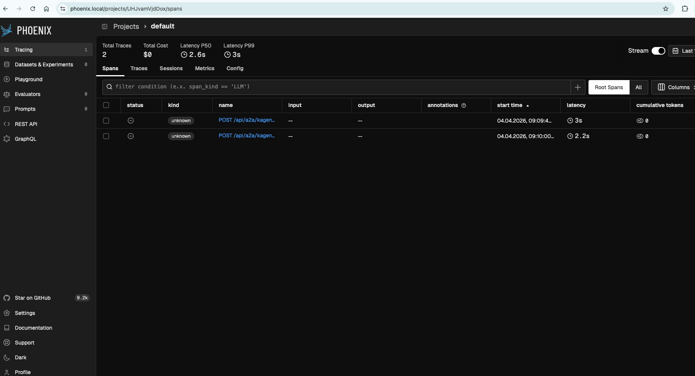
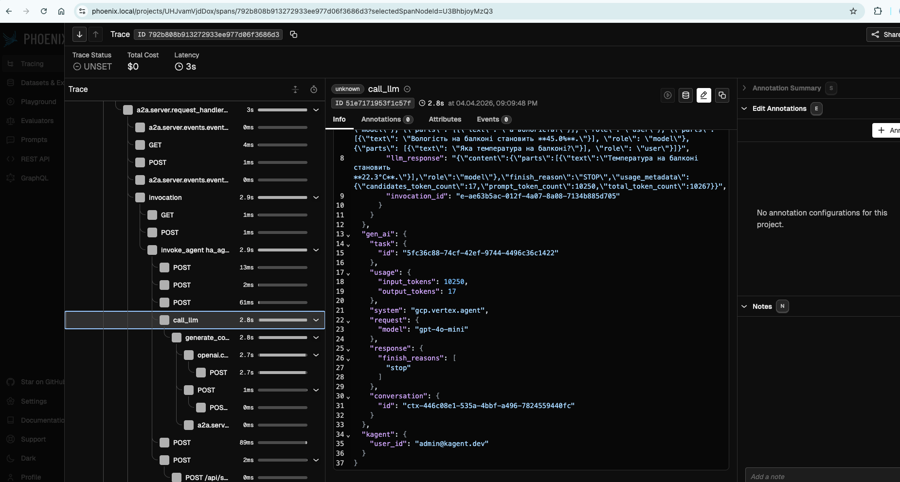

# Лабораторна №6 — Tracing / Phoenix

## Мета
Налаштувати tracing для MCP server та отримати trace у Phoenix.

## Виконано
- MCP server використовується агентом `ha-agent`
- Виконано запит через kagent UI
- У Phoenix отримано trace запиту
- Видно виклики, latency та ланцюг виконання

# Tracing notes

## Сценарій
У kagent UI для агента `ha-agent` було виконано запит на отримання температури з Home Assistant.

## Результат
У Phoenix відображається trace запиту з деталями:
- HTTP request chain
- latency
- внутрішні spans
- обробка запиту агентом

Phoenix дозволяє переглянути повний trace виконання запиту агента, включаючи виклики MCP та часові характеристики.
- 
- 