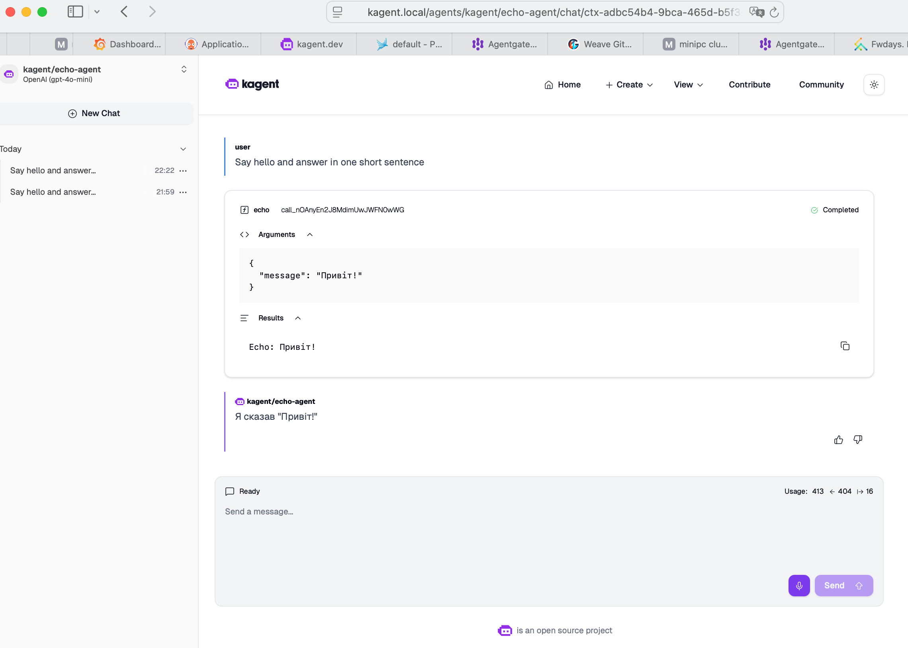

# Лабораторна №7 — Prompt Enrichment та Tracing

## Опис

У цій лабораторній роботі було реалізовано Prompt Enrichment на рівні gateway з використанням AgentGateway, а також використано вже налаштований tracing (Lab 6) для перевірки поведінки системи.

---

## Архітектура

Потік запиту:

User → Kagent UI → AgentGateway → (Prompt Enrichment) → LLM → Response

Prompt Enrichment виконується на рівні AgentGateway і дозволяє змінювати prompt без змін у коді агента.

---

## Реалізація Prompt Enrichment

Було створено Kubernetes ресурс `AgentgatewayPolicy`:

```yaml
apiVersion: agentgateway.dev/v1alpha1
kind: AgentgatewayPolicy
metadata:
  name: prompt-enrichment
  namespace: agentgateway-system
spec:
  targetRefs:
    - group: gateway.networking.k8s.io
      kind: HTTPRoute
      name: llm
  backend:
    ai:
      prompt:
        prepend:
          - role: system
            content: |
              You are a smart home assistant.
              Always answer in Ukrainian.
```

---

## Статус policy

```bash
kubectl get agentgatewaypolicy -n agentgateway-system
```

Результат:

- Accepted: True
- Attached: True

---

## Перевірка роботи (Evidence)

### Вхідний запит

Say hello and answer in one short sentence

### Відповідь системи

Я сказав "Привіт!".

---


## Аналіз результату

- Користувач не задавав мову відповіді
- Агент не містить логіки вибору мови
- System prompt не передається клієнтом

Проте відповідь отримано українською мовою, що означає:

Prompt був змінений на рівні gateway  
Prompt Enrichment працює коректно  

---

## Tracing (Phoenix)

Tracing не налаштовувався повторно, а було використано інтеграцію з Lab 6.

Було перевірено:
- проходження запиту через gateway
- виклик LLM
- результат відповіді

---

## Висновок

У рамках лабораторної роботи:

- реалізовано Prompt Enrichment через AgentGateway
- продемонстровано вплив system prompt на відповідь моделі
- використано існуючий tracing для observability

Prompt Enrichment дозволяє централізовано керувати поведінкою LLM без змін у коді агентів або клієнтів.

---

## Додаткові артефакти

```bash
kubectl get agentgatewaypolicy prompt-enrichment -n agentgateway-system -o yaml
```
```text
apiVersion: agentgateway.dev/v1alpha1
kind: AgentgatewayPolicy
metadata:
  annotations:
    kubectl.kubernetes.io/last-applied-configuration: |
      {"apiVersion":"agentgateway.dev/v1alpha1","kind":"AgentgatewayPolicy","metadata":{"annotations":{},"name":"prompt-enrichment","namespace":"agentgateway-system"},"spec":{"backend":{"ai":{"prompt":{"prepend":[{"content":"You are a smart home assistant.\nAlways answer in Ukrainian.\n","role":"system"}]}}},"targetRefs":[{"group":"gateway.networking.k8s.io","kind":"HTTPRoute","name":"llm"}]}}
  creationTimestamp: "2026-04-05T20:53:02Z"
  generation: 1
  name: prompt-enrichment
  namespace: agentgateway-system
  resourceVersion: "34050391"
  uid: 8d88a835-fff4-46fd-99c8-e125093493cb
spec:
  backend:
    ai:
      prompt:
        prepend:
        - content: |
            You are a smart home assistant.
            Always answer in Ukrainian.
          role: system
  targetRefs:
  - group: gateway.networking.k8s.io
    kind: HTTPRoute
    name: llm
status:
  ancestors:
  - ancestorRef:
      group: gateway.networking.k8s.io
      kind: Gateway
      name: agentgateway-proxy
      namespace: agentgateway-system
    conditions:
    - lastTransitionTime: "2026-04-05T20:53:16Z"
      message: Policy accepted
      reason: Valid
      status: "True"
      type: Accepted
    - lastTransitionTime: "2026-04-05T20:53:16Z"
      message: Attached to all targets
      reason: Attached
      status: "True"
      type: Attached
    controllerName: agentgateway.dev/agentgateway

```


```bash
kubectl get httproute llm -n agentgateway-system -o yaml
```
```text
apiVersion: gateway.networking.k8s.io/v1
kind: HTTPRoute
metadata:
  annotations:
    argocd.argoproj.io/tracking-id: agentgateway-config:gateway.networking.k8s.io/HTTPRoute:agentgateway-system/llm
  creationTimestamp: "2026-03-15T21:15:16Z"
  generation: 1
  name: llm
  namespace: agentgateway-system
  resourceVersion: "30341005"
  uid: ffdb7959-2bb5-433b-9ac4-f9a32848a228
spec:
  parentRefs:
  - group: gateway.networking.k8s.io
    kind: Gateway
    name: agentgateway-proxy
    namespace: agentgateway-system
  rules:
  - backendRefs:
    - group: agentgateway.dev
      kind: AgentgatewayBackend
      name: llm
      namespace: agentgateway-system
      weight: 1
    matches:
    - path:
        type: PathPrefix
        value: /
status:
  parents:
  - conditions:
    - lastTransitionTime: "2026-03-15T21:12:53Z"
      message: ""
      observedGeneration: 1
      reason: Accepted
      status: "True"
      type: Accepted
    - lastTransitionTime: "2026-03-15T21:12:53Z"
      message: ""
      observedGeneration: 1
      reason: ResolvedRefs
      status: "True"
      type: ResolvedRefs
    controllerName: agentgateway.dev/agentgateway
    parentRef:
      group: gateway.networking.k8s.io
      kind: Gateway
      name: agentgateway-proxy
```